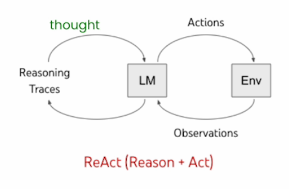
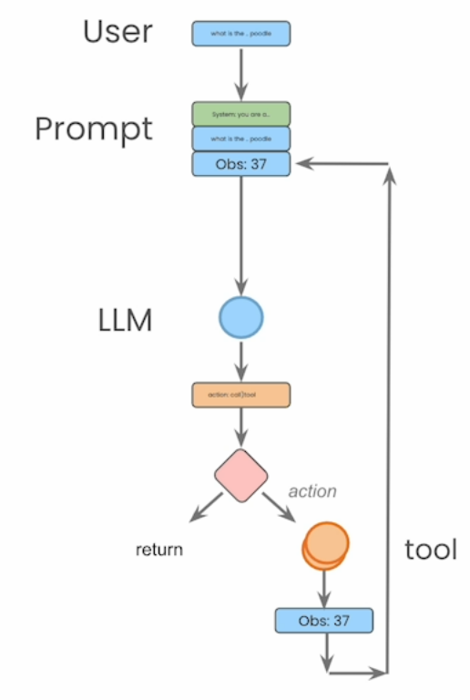

# Lab 1: Building a ReAct Agent from Scratch

Welcome to this section on building a ReAct (Reasoning and Acting) agent from scratch using Amazon Bedrock and Anthropic's Claude model. 

The ReAct approach aims to combine reasoning (e.g. chain-of-thought prompting) and acting (e.g. action plan generation) capabilities of large language models (LLMs) in an interleaved manner. It was proposed in the paper [ReAct: Synergizing Reasoning and Acting in Language Models](https://arxiv.org/abs/2210.03629).

The structure of the agent within the section looks like the picture below, with components:
- User Input
- System prompt
- Language Model
- Identified action
- Tool to be executed by the action

Let's begin!
