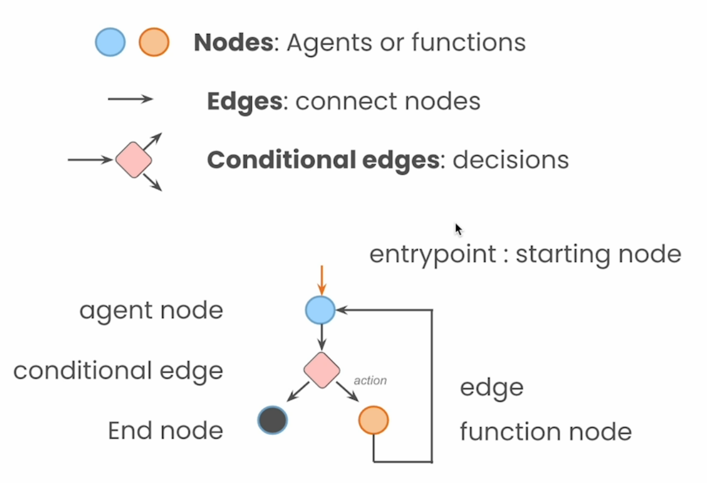

# Lab 2: LangGraph Components

Welcome to this section on implementing intelligent agents using LangGraph, Anthropic's Claude model, and Amazon Bedrock. In our previous session, we took a hands-on approach by implementing a REACT (Reasoning and Acting) agent from scratch. This exercise gave us a fundamental understanding of how these agents operate and make decisions.

Now, we're taking a significant step forward. We'll be leveraging LangGraph, a powerful framework for creating structured conversations and decision-making flows with language models. Instead of building everything from the ground up, we'll use LangGraph to create a more sophisticated and flexible agent. We'll also be upgrading our language model, moving from a basic implementation to using Anthropic's Claude model via Amazon Bedrock.

This section will demonstrate how to create a robust, scalable agent capable of handling complex, multi-step queries. You'll see how the structure provided by LangGraph enhances our agent's capabilities, and how the advanced features of Claude and the scalability of Amazon Bedrock take our implementation to the next level.
By the end of this section, you'll have a clear understanding of how to use these tools to create state-of-the-art AI agents for real-world applications. 

In essence, LangGraph is an extension of LangChain that supports graphs. Single and Multi-agent workflows are described and represented as graphs. The tool allows for well controlled "flows".

The components of a LangGraph graph are depicted in the image below.

Let's dive in!
