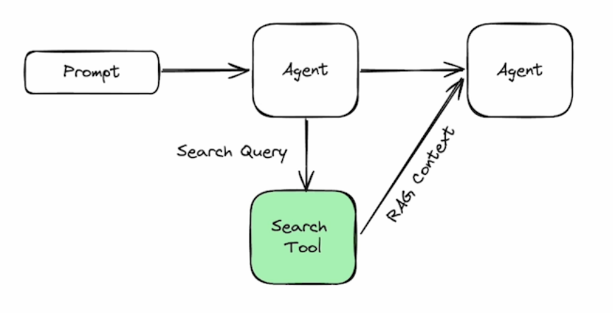
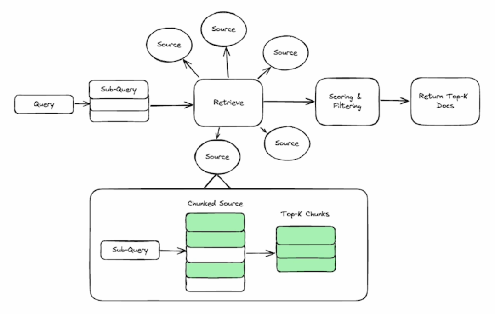

# Lab 3: Agentic Search Tools

Welcome to this section introducing the concept of agentic search, a more advanced form of search used by AI agents. Unlike standard search or zero-shot learning, agentic search allows agents to access dynamic data, provide sources for information, and handle complex queries by breaking them down into sub-questions. The process involves understanding the query, selecting the best source for information, extracting relevant data, and filtering out less important details. This approach helps reduce hallucinations and improves human-computer interaction.

The section demonstrates the difference between regular search tools and agentic search tools through practical examples. Using a weather query for San Francisco, it shows how a regular search (using `DuckDuckGo`) provides links that require further processing to extract useful information. In contrast, the agentic search tool (using `Tavily`) returns structured data in JSON format, which is ideal for AI agents to process. 

A basic example of an agentic search tool implementation is shown in the picture below.

When the agent decides to send the query to the search tool, it would first work on understanding the question and divide it to sub-questions if needed. This is an important point because it allows agents to handle complex queries. Then, for each subquery, the search tool will have to find the best source, choosing from multiple integrations. For example, if an agent would ask "How is the weather in San Francisco?" The search tool should use the weather API for best results. The job doesn't end with finding the correct source. The search tool would then have to extract only the relevant information to the subquery. 

A basic implementation of this can be achieved through a process of chunking the source, and run a quick vector search to retrieve the top-K chunks. After retrieving the data from its source, the search tool would then score the results and filter out the less relevant information. This implementation is shown in the picture below.

Let's dive in!