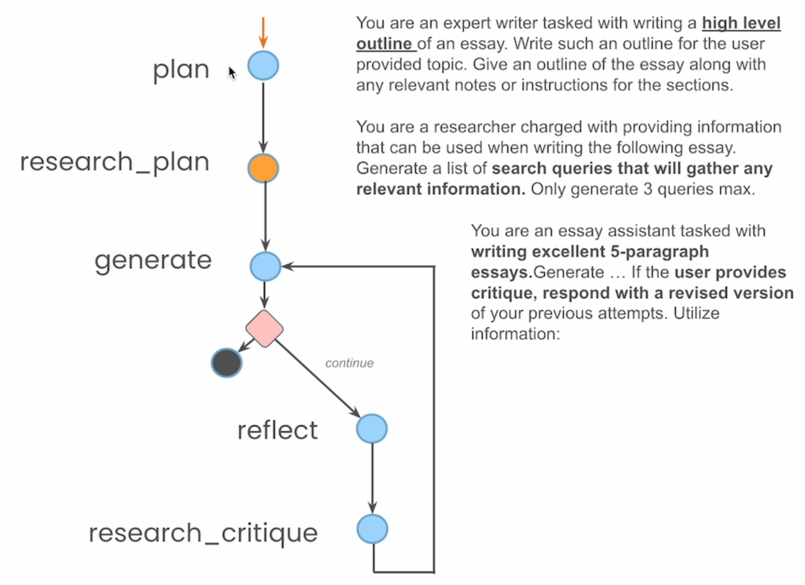
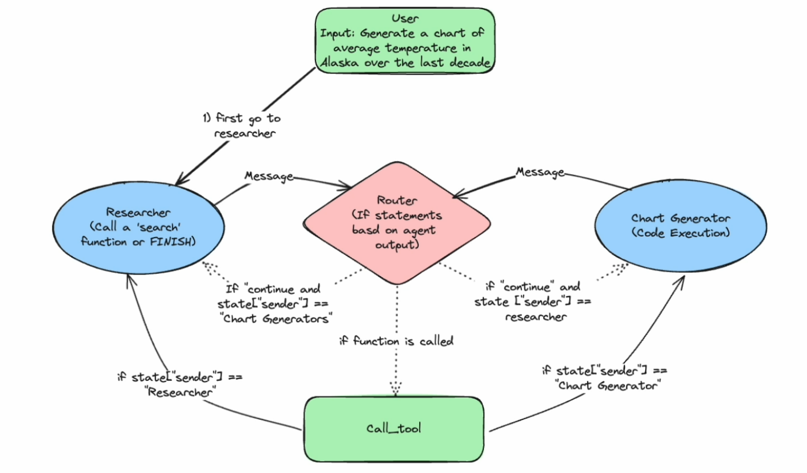
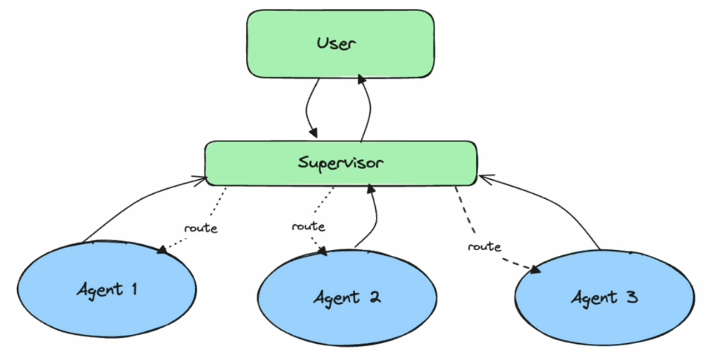
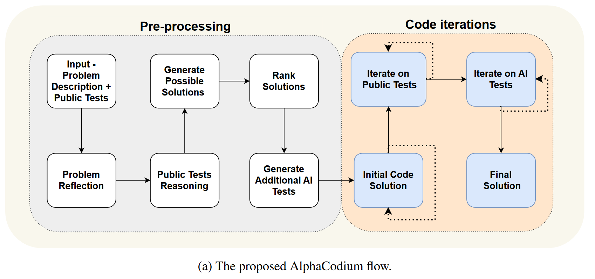

# Lab 6: Essay Writer

In this section, we'll embark on an exciting project that brings together various concepts we've learned so far: we're going to build an AI-powered Essay Writer. This project will demonstrate how to create a more complex, multi-step AI agent using Amazon Bedrock and Anthropic's Claude model.

## What You'll Learn

1. How to structure a multi-agent system for a complex task
2. Implementing a state machine using LangGraph
3. Integrating external research capabilities with the Tavily API
4. Using Claude on Amazon Bedrock for various subtasks within the system
5. Building a simple GUI to interact with your AI Essay Writer

## Project Overview

Our Essay Writer will work through several stages:

1. Planning: Generate an outline for the essay
2. Research: Use Tavily to gather relevant information
3. Writing: Generate a draft based on the plan and research
4. Reflection: Critique the current draft
5. Iteration: Revise the essay based on the critique

The flow of the agent is represented in the picture below

By the end of this section, you'll have a functional AI Essay Writer that can generate, critique, and refine essays on various topics. This project will give you hands-on experience in building a practical, multi-step AI application using state-of-the-art language models and tools.

Let's dive in and start building our AI Essay Writer!

# Conclusion

At the end of this workshop, you should have a good idea on how to build your own agents. Before to conclude, we will cover some other agent architectures that you should know about. 

- [Multi-Agent Collaboration](https://github.com/langchain-ai/langgraph/blob/main/docs/docs/tutorials/multi_agent/multi-agent-collaboration.ipynb):
In a multi-agent architecture, multiple agents work collaboratively on a shared state. These agents could be a combination of prompts, language models, and tools, each contributing their capabilities. The key aspect is that they all operate on and pass around the same shared state, allowing them to build upon each other's work iteratively.

- [Supervisor Agent](https://github.com/langchain-ai/langgraph/blob/main/docs/docs/tutorials/multi_agent/agent_supervisor.ipynb):
A supervisor agent architecture involves a central supervisor agent that coordinates and manages the inputs and outputs of various sub-agents. The supervisor determines the specific inputs and tasks for each sub-agent, which can have their own internal states and processes. Unlike the multi-agent approach, there is no single shared state, but rather the supervisor orchestrates the flow of information between the sub-agents.

- [Flow Engineering](https://arxiv.org/abs/2401.08500):
Flow engineering, as described in the AlphaCode paper, refers to designing architectures with a directed flow of information, punctuated by iterative loops at key points. This approach combines a linear pipeline with cyclical iterations, tailored to specific problem domains like coding. The goal is to engineer the optimal flow of information and decision-making for the task at hand.

- [Plan and Execute](https://github.com/langchain-ai/langgraph/blob/main/docs/docs/tutorials/plan-and-execute/plan-and-execute.ipynb):
The plan and execute paradigm involves an explicit planning phase followed by an execution phase. First, a plan or set of steps is generated, which sub-agents then execute sequentially. After each step, the plan may be updated or revised based on the results, and the process continues until the plan is completed or a replanning is required.

- [Language Agent Tree Search](https://github.com/langchain-ai/langgraph/blob/main/docs/docs/tutorials/lats/lats.ipynb):
This approach performs a tree search over possible action states, generating actions, reflecting on them, and backpropagating information to update parent nodes. It allows for jumping back to previous states in the tree, enabling the agent to explore different action paths while leveraging information from earlier reflections and updates.

